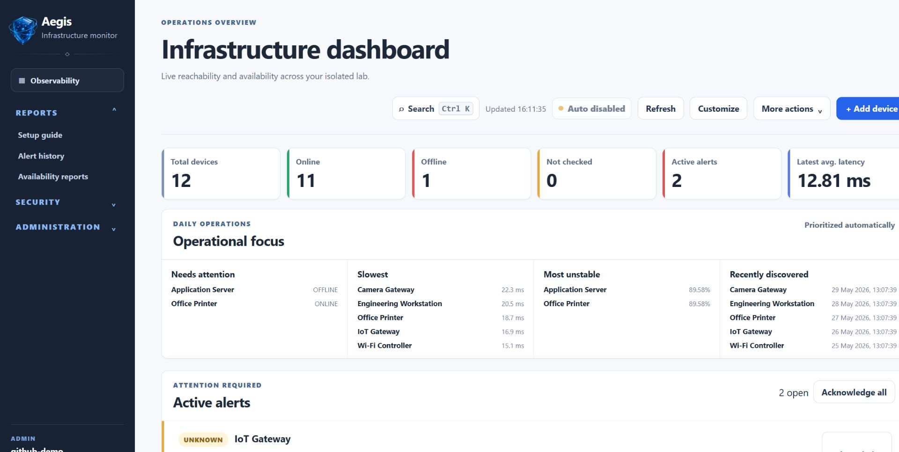
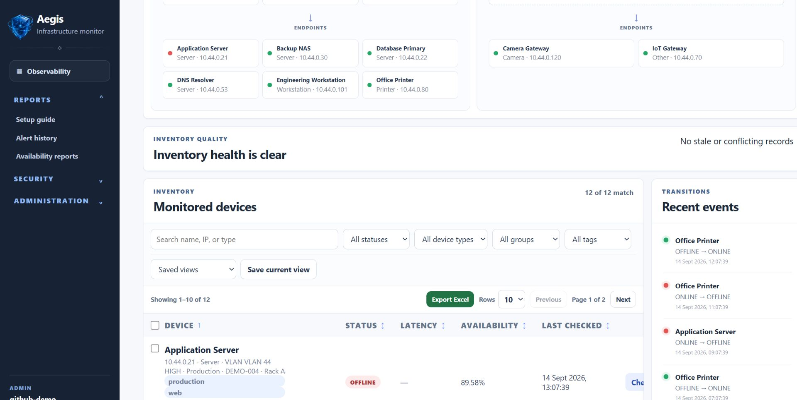
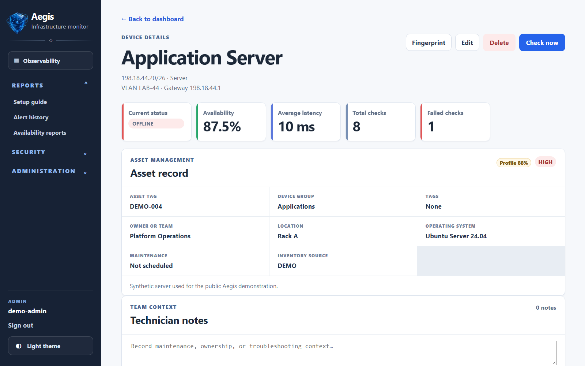
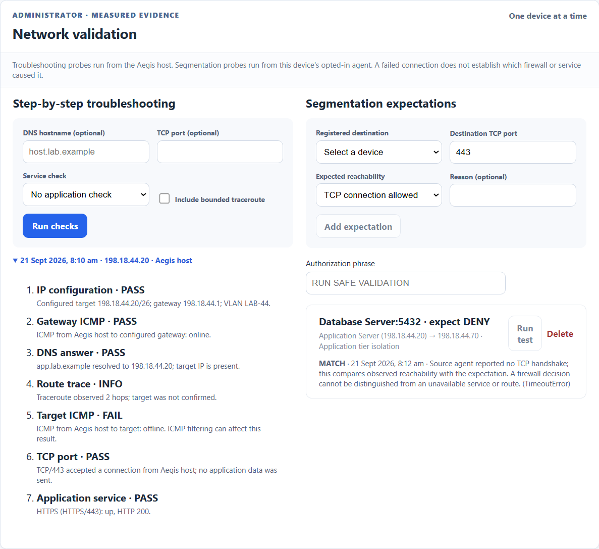
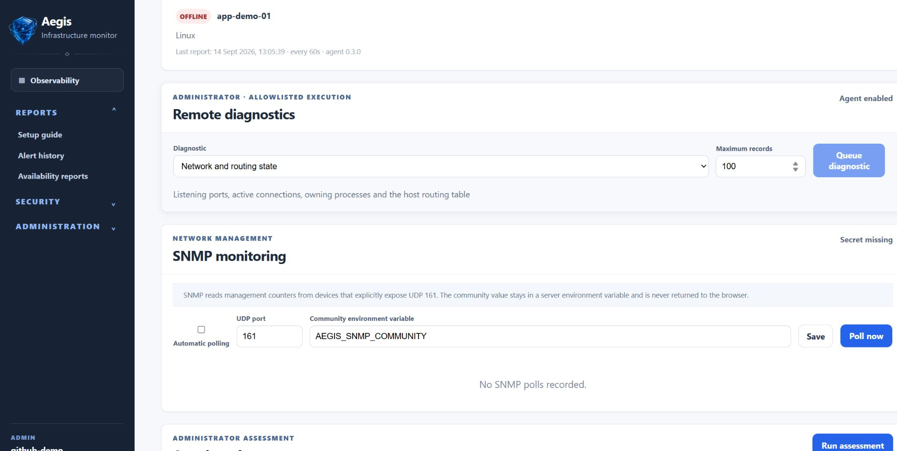
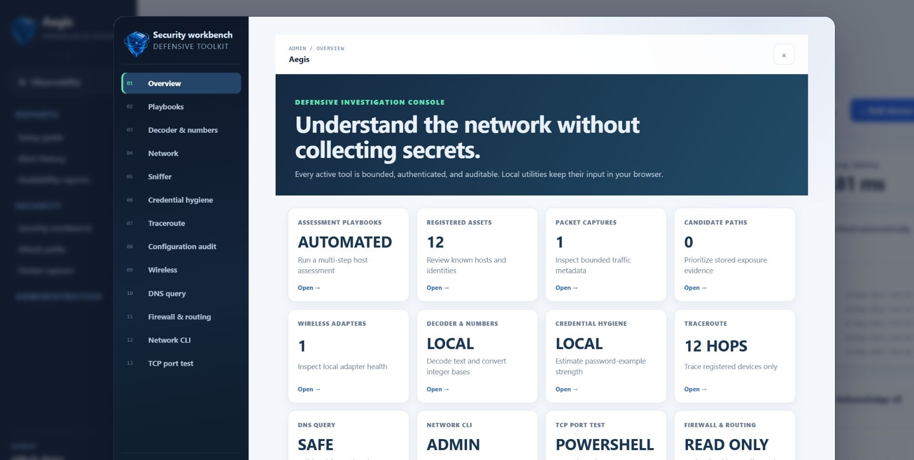
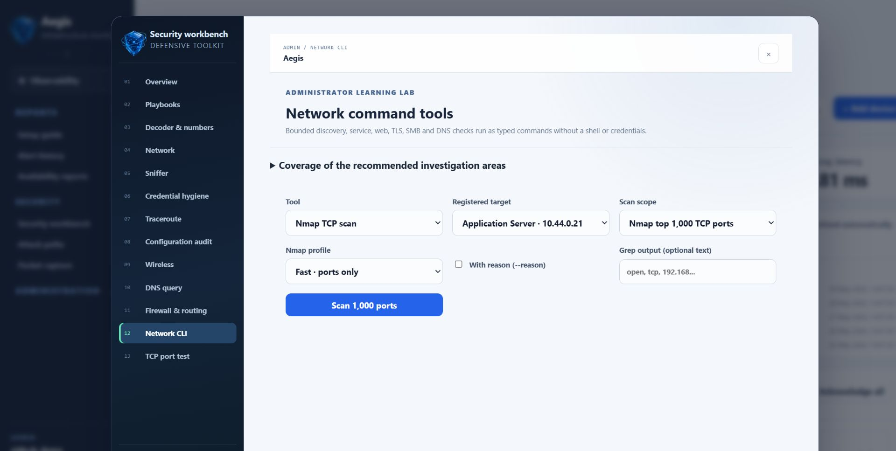
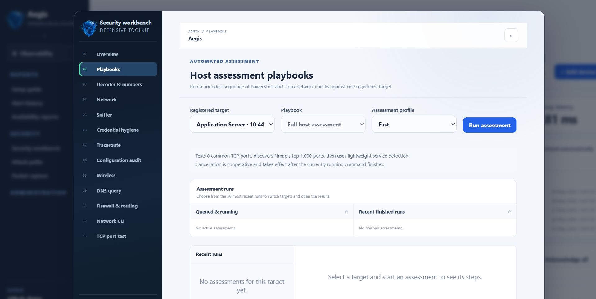

# Aegis

Aegis is a self-hosted infrastructure monitoring and defensive operations console for authorized private networks and isolated labs. It combines asset inventory, availability monitoring, service checks, host telemetry, alerting, reporting, and bounded security diagnostics in one responsive web interface.

Aegis keeps operational data under the operator's control. The standard installation uses SQLite for application data, Prometheus for time-series scraping, and Grafana for long-range visualization. It does not require a cloud service.

Public examples and screenshots use synthetic demonstration data, not an operator's network. Runtime inventory, captures, logs, credentials and machine-specific validation reports must stay local. [Publication privacy and pre-push checks](docs/REPOSITORY_PRIVACY.md).

> Aegis is intended for systems and networks you own or are explicitly authorized to assess. Its discovery, capture, diagnostic, and assessment tools are deliberately bounded and are not a substitute for authorization or change control.

## Start here

Aegis follows one operational loop:

```text
Register a device → Observe health → Assess exposure → Prioritize evidence → Remediate and reassess
```

| Your goal | Open | Result |
|---|---|---|
| See whether infrastructure is healthy | **Dashboard** | Current device, service, agent, alert, and inventory status. |
| Investigate one device | **Device record** | Monitoring history, services, telemetry, notes, findings, and asset context. |
| Run a repeatable security review | **Security workbench → Assessment** | A saved four-step assessment with network, service, mDNS, CVE, and DNS evidence. |
| Run one specific network test | **Assessment → Manual checks** | A bounded Nmap, TCP, traceroute, DNS, TLS, web, or SMB result. |
| Validate a device's network path | **Device record → Network validation** | Configured subnet context, ordered troubleshooting evidence, and expected source-to-destination TCP reachability. |
| Refresh local vulnerability intelligence | **Security workbench → CVE mirror** | Integrity-checked NVD CVE and CPE applicability data for local matching. |
| Confirm that Aegis itself is ready | **Administration → System status** | Database, scheduler, integrations, and supporting-tool readiness. |

For a short explanation of concepts, screens, result meanings, and the first assessment workflow, read the [project guide](docs/PROJECT_GUIDE.md). Planned improvements and their acceptance criteria are tracked in the [prototype roadmap](docs/PROTOTYPE_ROADMAP.md).

Measured API improvements, request budgets and regression checks are documented in [performance and security](docs/PERFORMANCE_SECURITY.md).

### First prototype walkthrough

1. Run `.\start-hybrid.ps1` and sign in as the local administrator.
2. Add one device manually or use **More actions → Discover network devices**.
3. Run a reachability check and confirm the device record shows a current result.
4. Open **Security workbench → Assessment**, choose the device, and start with **Fast**.
5. Review findings as evidence to verify—not automatic proof of compromise or exploitability.
6. Apply an approved remediation and run the same assessment again to compare the result.

## Product capabilities

### Operations dashboard

| Function | What it does |
|---|---|
| Infrastructure summary | Shows total, online, offline, and unchecked devices together with active alerts and scheduler state. |
| Device inventory | Presents current status, response time, availability, last check, type, group, and other identifying information in one table. |
| Search and filters | Filters devices by name, IP address, type, group, and monitoring status. Saved views preserve frequently used filter combinations in the browser. |
| Sorting and pagination | Sorts inventory by device name, status, latency, availability, or last-check time and supports 10, 25, or 50 rows per page. |
| Bulk actions | Checks selected devices, changes their operational group, or enables and pauses monitoring as one validated operation. |
| Operational insights | Highlights devices that need attention and links directly to the relevant device record. |
| Inventory health | Identifies incomplete asset records so operators can improve ownership, classification, and support information. |
| Service-health overview | Summarizes monitored TCP, HTTP, and HTTPS services and exposes unhealthy checks without opening each device. |
| Remote-agent fleet | Summarizes enrolled collectors as waiting, reporting, delayed, or offline and prioritizes stale agents. |
| Logical topology | Groups devices by configured subnet prefix and VLAN, labels unknown subnets, and displays operator-confirmed links separately. |
| Command palette | Opens devices and operational panels from a keyboard-searchable menu using `Ctrl+K` or `Cmd+K`. |
| Responsive navigation | Provides mobile navigation, fixed desktop navigation, collapsible sections, light and dark themes, readable typography, and keyboard focus states. |



*Operations dashboard with synthetic prototype data.*

The dashboard refreshes every 15 seconds. **Check all** runs an immediate reachability check for every active device and stores the results through the same alert and history pipeline used by scheduled monitoring.

### Asset inventory and device records

| Function | What it does |
|---|---|
| Device management | Creates, edits, views, and deletes monitored devices with normalized IPv4 or IPv6 addresses and duplicate-address protection. |
| Network placement | Records the actual prefix length, gateway, and VLAN for each device; unknown values remain explicit. |
| Device groups | Assigns an operational group such as a site, floor, lab, or business unit for filtering and bulk administration. |
| Device profile | Combines availability statistics, latency history, status transitions, service checks, telemetry, SNMP, alerts, assessments, and agent state on one page. |
| Notes | Stores timestamped operational notes against a device. |
| Attachments | Stores validated UTF-8 text, PDF, PNG, and JPEG files up to 5 MiB. Files use randomized storage names and download as attachments. |
| Activity timeline | Merges important device events into a chronological operational history. |
| Change history | Records material changes to inventory data for later review. |
| DHCP import | Allows administrators to import lease information, including optional prefix and gateway fields, with validation and duplicate handling. |
| CSV export | Exports the complete filtered and sorted inventory as UTF-8 CSV, independent of the current page. |
| Excel export | Creates a formatted `.xlsx` workbook with typed values, filters, frozen headers, and a formula-driven summary sheet. The Excel library loads only when requested. |
| Shareable device URLs | Gives every device a direct URL such as `/devices/1` and supports normal browser Back and Forward navigation. |



*Filterable inventory, topology context, and recent monitoring activity.*



*Device profile combining availability with a synthetic asset record and configured network context.*

### Availability, services, and alerts

| Function | What it does |
|---|---|
| Reachability checks | Performs bounded cross-platform ping checks and stores online/offline state, successful latency, timestamps, and normalized errors. |
| Automatic monitoring | Runs one lifecycle-managed scheduler that checks active devices at the configured interval. Operators can pause and resume scheduling without disabling manual checks. |
| Availability statistics | Calculates successful and failed checks, availability percentage, average successful latency, and current state from stored history. |
| Status transitions | Derives online-to-offline and offline-to-online events from monitoring history. |
| Service checks | Monitors TCP ports and HTTP or HTTPS endpoints on registered devices. HTTP checks use a validated path and record response time and status code. |
| Service history | Shows recent results, uptime, successful and failed totals, average response time, and a dependency-free response-time chart. |
| TCP port scan | Scans Nmap's 1,000 most common TCP ports on a registered device, using Nmap when available and a bounded host-side socket scanner otherwise, then can turn an open port into a scheduled service check. |
| Attack-surface CVE correlation | Discovers open TCP ports and automatically gathers WhatWeb technology versions and OpenSSL/sslscan TLS evidence where the detected protocol applies; SMB reuses curated NSE posture checks. Separate products use the local NVD mirror with online fallback; contradictory versions are withheld. Bounded Nuclei and CISA KEV/FIRST EPSS evidence support review. See [automatic service evidence](docs/AUTOMATIC_SERVICE_ENRICHMENT.md) for budgets and limitations. |
| Device fingerprinting | Uses bounded network evidence such as open services, manufacturer information, and mDNS/DNS-SD names, service types, and advertised model metadata to suggest a device classification. |
| Alert rules | Creates per-device rules for consecutive failures and high latency. Alerts persist, can be acknowledged, and resolve automatically after recovery. |
| Alert history | Provides a searchable operational record of active, acknowledged, and resolved alert events. |
| Maintenance windows | Suppresses expected monitoring noise during approved maintenance periods without deleting monitoring configuration. |

### Host telemetry and anomaly detection

| Function | What it does |
|---|---|
| Local host metrics | Collects CPU, memory, and system-disk utilization for loopback devices. |
| Remote host agent | Accepts authenticated CPU, memory, and disk samples from enrolled Windows or Linux collectors. Each enrollment has a one-time token; only its SHA-256 digest is stored. |
| Agent health | Derives waiting, reporting, delayed, and offline states from the collector's reporting interval. A previously reporting agent that becomes offline raises one persistent alert and resolves it when reporting resumes. |
| SNMP v2c polling | Reads the standard system description, name, location, uptime, and interface-count OIDs. Community values stay in environment variables and are not stored in SQLite. |
| Local anomaly detection | Builds a per-device baseline after at least 21 samples using the median and median absolute deviation, then flags unusual latency, CPU, memory, or disk values. |

Anomaly results are operational indicators, not diagnoses. Aegis performs this analysis locally and does not send telemetry to an external AI provider.

### Network visibility and defensive security

| Function | What it does |
|---|---|
| Local network discovery | Detects the active physical Windows adapter, presents its network for confirmation, and probes at most one local `/24`. Existing addresses are skipped; available MAC addresses, mDNS friendly names, advertised models, and DNS-SD services are merged into inventory. |
| Network change reset | Remembers the last discovered subnet in the browser. When the connected subnet changes, the administrator is offered an exact-phrase reset before discovery so identical private IP ranges from different labs are not mixed. The same reset is available under **More actions**. |
| Network topology | Groups devices by configured prefix and VLAN, shows a configured gateway when known, and labels unknown subnets instead of assuming `/24` or `/64`. Supports confirmed `UPLINK`, `CONNECTS TO`, `ROUTES TO`, and `MANAGES` relationships. |
| Network troubleshooting | Saves ordered IP configuration, gateway ICMP, DNS, route, target ICMP, TCP port, and optional service observations from the Aegis host on each device record. |
| Segmentation expectations | Records expected source-agent-to-destination TCP reachability and compares it with bounded agent probes. A failed handshake alone does not prove a firewall rule blocked traffic. |
| Attack-surface assessment | Checks the ranked top 1,000 TCP ports, identifies exposed management, cleartext, database, and infrastructure services, runs time-bounded version detection, inspects HTTP security headers and TLS posture, runs signed Nuclei exposure, misconfiguration, and TLS templates, correlates supported fingerprints with NVD CVEs, and prioritizes candidates with CISA KEV and FIRST EPSS evidence. |
| Assessment comparison | Compares the two latest assessments, calculates a capped 0–100 exposure score, and separates new, persistent, and resolved findings. Informational evidence does not increase the score. |
| Passive attack paths | Correlates stored assessment results with groups, subnets, criticality, and remote-access services to prioritize possible paths between registered assets. It sends no additional traffic. |
| Wireshark packet analysis | Opens the real Wireshark GUI in an optional Docker sidecar sharing the toolbox's network namespace. Inspect scans, protocol fields and TCP streams, save PCAP/PCAPNG in a dedicated volume, or import host-captured files. Windows physical interfaces are not directly visible. Previous metadata capture records remain available as legacy history. |
| Remote diagnostics and safe validation | Dispatches only fixed, administrator-approved job types to explicitly enabled agents. Safe simulations include signed callbacks, synthetic credential canaries, password-policy inspection, temporary markers, generated-file activity, benign detection variations, registered-device segmentation probes, and signed non-executable artifacts. Jobs are device-bound, parameter-bounded, expire after 15 minutes, clean up generated data, and cannot contain arbitrary commands. |
| Wireless status | Reports the local Aegis host's wireless-adapter state without collecting Wi-Fi keys or handshakes. |



*Network validation on synthetic demo devices. Troubleshooting runs from the Aegis host; the segmentation result compares an agent-reported TCP outcome with the expected path. A failed handshake does not identify the cause.*



*Remote diagnostics expose only the fixed, bounded job set enabled for the selected agent.*

Attack-surface findings and passive attack paths are prioritization evidence, not proof of exploitability. Confirm important results against firewall policy, network design, patch records, and approved validation procedures.

### Security workbench

The administrator-only **Security workbench** consolidates defensive investigation tools without turning Aegis into a credential or interception suite. Active tools accept registered unicast hosts; network, broadcast, multicast, and unspecified addresses are rejected as single-device targets.



*Security workbench overview and live evidence from registered assets.*

| Tool | What it does |
|---|---|
| Decoder and encoder | Converts Base64, hexadecimal, and URL components entirely in the browser. Input is not sent to the API. |
| Integer and bitwise converter | Converts practical-size integers between decimal, hexadecimal, binary, and octal and performs signed AND, OR, XOR, NOT, left-shift, and right-shift operations locally. |
| Secure password generator | Generates random 16-, 20-, 24-, or 32-character passwords with browser cryptographic randomness and supports masked display and copying. |
| Password-strength guide | Evaluates a disposable example locally, displays a four-stage strength meter, and explains how length, character variety, repetition, sequences, and predictable words affect the result. Real passwords should never be entered. |
| Registered inventory search | Searches known assets and their recorded details without scanning arbitrary targets. |
| Wireshark | Opens the Docker Wireshark GUI, explains capture versus display filters and generates registered-device filter examples. Existing metadata records remain readable under legacy capture history. |
| Traceroute | Runs a validated trace of at most 12 hops and 20 seconds to a selected registered device. |
| Configuration review | Highlights incomplete inventory records and summarizes stored candidate attack paths without extracting device configurations. |
| DNS query | Performs validated forward and reverse DNS lookups without constructing shell commands from user input. |
| TLS inspection | Runs `sslscan` or an OpenSSL certificate/session inspection against a registered device and selected TLS port. Execution is capped, application data is not sent, and Heartbleed probing is disabled. |
| Web technology and exposure checks | Runs WhatWeb's light fingerprint profile or a non-interactive Nikto assessment against one HTTP(S) endpoint on a registered device. Operators choose the scheme, port, and validated path; Nikto is capped at 45 seconds. |
| SMB posture | Lists services through an anonymous `smbclient` session or runs fixed Nmap scripts for SMB protocol, signing, and time posture. The API does not accept usernames, passwords, hashes, domains, or arbitrary scripts. |
| Network CLI | Runs administrator-only Nmap TCP scans and a separate bounded scan of up to 64 UDP ports against registered devices. TCP scanning defaults to an IDS-friendly traffic policy capped at 100 probes per second, with an explicit fast-mode override. Both provide Fast, Detailed (`-sV --version-light`), and Aggressive (`-sV --version-all`) depth where applicable. It also provides registered-host `fping`, local ARP discovery, `avahi-browse` DNS-SD inspection, the host neighbor table, HTTP(S) `curl`, WhatWeb, Nikto, `sslscan`, OpenSSL, anonymous `smbclient`, a fixed Nmap SMB posture check, and `dig`, `host`, or standard-record DNSRecon queries with optional literal line filtering. Commands use typed arguments, profile-specific timeouts, capped output, and closed stdin without invoking a shell. |
| PowerShell TCP test | Tests up to 128 TCP ports concurrently on one registered device. PowerShell 7 uses `Test-Connection -TcpPort`; Windows PowerShell uses bounded .NET TCP socket probes. Results distinguish open ports, refused connections, unanswered probes, and errors, while targets and ports are passed as validated data rather than command text. |
| Assessment workspace | Combines the persistent four-step playbook with manual checks on one page. Automated reachability and traceroute lead into Nmap top-1,000 discovery, mDNS identity, protocol-directed WhatWeb/OpenSSL/sslscan evidence, reused SMB NSE posture and CVE correlation, then DNS identity. Each selected tool's status, command and evidence are visible; profiles control depth and additional collection budgets. |

The toolbox pins official **Nmap 7.991** and its matching probe/script database, with a verified source archive SHA-256. Managed Docker scans use SYN discovery (`-sS`, with `NET_RAW`); application fingerprints and host-side scans use TCP connect (`-sT`). This avoids a locally reproduced repeated-source-port connection failure during SYN-mode version detection. Detailed TCP service detection allows 90 seconds of host time; Aggressive allows 180 seconds (100/200-second process budgets). Top-1,000 scans fingerprint only discovered open ports and preserve discovery evidence if fingerprinting is incomplete. CLI output records the Nmap version, execution context and actual commands; assessments save scanner provenance alongside their findings.

When comparing against Kali, match the Nmap version and `nmap-service-probes`, target, TCP port list, scan type and `-sV` intensity. Aegis Docker and a Kali VM may leave through different source IPs/interfaces, so a firewall or service can return different evidence even with identical flags. `Aggressive` means `--version-all`, not Nmap's `-A` option.



*Typed network-tool commands restrict execution to registered targets and bounded profiles.*



*Persistent host-assessment playbooks with target and depth controls.*

Packet analysis now uses the optional [Docker Wireshark GUI](docs/WIRESHARK.md). It can retain full packet payloads in a dedicated Docker volume; captures are not stored in the Aegis database, included in normal Aegis backups, or automatically correlated with CVEs. TLS application data is not automatically decrypted. The legacy metadata-capture API and history are preserved for compatibility.

Aegis does not provide password or hash cracking, credential harvesting, ARP poisoning, man-in-the-middle routing, Wi-Fi key recovery, router-configuration theft, exploit execution, brute force, or arbitrary remote command execution. NetExec and credentialed SMB enumeration are deliberately excluded. OpenVAS, Nessus, Zeek, and Suricata require separately operated scanners or sensors; Lynis and osquery require a future host-agent result model rather than misleadingly auditing the toolbox container.

### Reports and observability

| Function | What it does |
|---|---|
| Availability reports | Produces date-bounded availability, outage, and latency summaries from stored monitoring results. |
| Scheduled reports | Generates local availability-report files on an administrator-defined schedule and keeps a downloadable report history. |
| Prometheus metrics | Exposes authenticated OpenMetrics data for device state, latency, unresolved alerts, service health, host utilization, and scheduler state. |
| Embedded Grafana | Displays the provisioned **Aegis Infrastructure Overview** dashboard inside the application with device, alert, service, latency, and resource panels. |
| System status | Checks application readiness, database access, supporting tools, configured secrets, scheduler state, and integration availability from one administrator view. |

Prometheus authenticates with a bearer token stored in `secrets/prometheus_token.txt`. Grafana is provisioned automatically and its anonymous Viewer access is bound to the local host by default; administrative Grafana changes still require its administrator account.

### Notifications, administration, and resilience

| Function | What it does |
|---|---|
| Notification channels | Sends alert notifications through email, Microsoft Teams, or Twilio SMS. Administrators can configure non-secret settings, send tests, inspect delivery history, and retry failures. |
| Delivery control | Queues each alert/channel pair once and retries failed automatic deliveries at most three times. Integration secrets remain in environment variables. |
| User administration | Creates local users, assigns roles, enables or disables accounts, resets passwords, and revokes sessions when access changes. |
| Audit log | Records authenticated write operations with actor, role, method, route, response status, source address, and timestamp. Request bodies, passwords, and tokens are excluded. |
| Automation center | Manages maintenance windows, correlated incidents, allowlisted incident diagnostics, scheduled reports, configuration baselines, agent-version visibility, and advisory health summaries. |
| Configuration drift | Compares recorded device information with stored baselines and surfaces material changes for review. |
| Health summary | Produces a built-in operational summary. An optional local Foundry model can rewrite that summary when explicitly configured; the built-in result remains the fallback. |
| Backups | Creates verified SQLite snapshots when due, supports manual creation and verification, and keeps the configured number of recent backups. Rebuildable CVE mirror rows are excluded by default. |
| History retention | Previews aged monitoring data before deletion, requires an explicit confirmation phrase, and creates a verified safety backup before cleanup. Configuration and identity records are preserved. |

Network-changing automations—automatic discovery, service discovery, and paced defensive assessment—remain disabled until an administrator explicitly enables them.

## Authentication and roles

The first browser visit creates the initial local administrator. Passwords must contain at least 12 characters and are hashed with scrypt using a unique random salt. Sign-in creates a random 12-hour opaque session token; only its SHA-256 digest is stored in SQLite, and sign-out revokes it.

| Role | Access |
|---|---|
| Administrator | Full monitoring and reporting access plus security tools, packet capture, automation, notification settings, backups, system status, audit events, and user management. |
| Operator | Device metadata, groups, basic monitoring, alerts, and topology management without active security testing or account controls. |
| Viewer | Read-only dashboards, device details, histories, statistics, charts, and stored findings. |

The API enforces permissions independently of the interface. Aegis prevents the last active administrator from being disabled or demoted. Disabling an account or resetting its password revokes existing sessions.

## Architecture

Aegis intentionally uses a small, inspectable architecture.

| Component | Technology | Responsibility |
|---|---|---|
| Web interface | React and Vite | Responsive dashboard, device workflows, reporting, administration, and browser-local utilities. |
| Application API | FastAPI and Pydantic | Authentication, validation, authorization, monitoring workflows, reporting, and administrative APIs. |
| Data store | SQLite and SQLAlchemy | Inventory, users, sessions, monitoring history, alerts, audit records, automation state, and configuration. |
| Scheduler and playbook runner | Bounded in-process workers | Periodic monitoring plus a single-worker queue for persistent administrator-requested security assessments. |
| Agent ingress | Separate FastAPI process in hybrid mode | Narrow endpoint surface for remote metrics and diagnostic job exchange. |
| Observability | Prometheus and Grafana | Metric retention, querying, and provisioned infrastructure dashboards. |

SQLite is appropriate for a single Aegis application instance. The Kubernetes manifests intentionally run one backend replica; horizontal backend scaling requires migration to a shared database such as PostgreSQL and coordination of scheduled work.

### Adaptive Nmap jobs

Network CLI TCP scans run through a durable, single-worker queue. Each job records the administrator, API client address, target snapshot, profile, traffic policy, timing, result and completion state. The UI polls the job record to show live phase/progress and can request cancellation; cancellation takes effect after the current bounded Nmap phase exits.

- Discovery always runs before optional service fingerprinting, and only confirmed open ports reach the deeper phase.
- Ports confirmed `closed` are cached for 10 minutes and skipped on matching scans. `filtered` and unanswered ports are never treated as closed.
- Open-port observations are retained for 24 hours. If all previously open ports disappear while Nmap reports filtering, packet loss or a timeout, the job is marked `PARTIAL` with a possible firewall/IDS block signal.
- Only one Nmap job runs at a time and each target may have only one queued or running job, limiting traffic bursts and preserving an auditable order.

### Local NVD CVE mirror

The Security Workbench CVE mirror imports official NVD JSON 2.0 feeds into normalized CVE and CPE applicability tables. Downloads are checked against the feed metadata's expanded size and SHA-256 digest before import. Exact CPE lookups evaluate the detected version against NVD start/end bounds locally; partial mirrors fall back to the online NVD API when no local candidate exists.

Use **Modified** for routine incremental refreshes and **Full** for the initial baseline. The full 2002-current corpus can require multiple gigabytes of temporary JSON/database space. Synchronization is asynchronous in the UI, reports feed progress, supports bounded cancellation, and retains verified completed batches.

The mirror is reproducible and can be large, so normal Aegis backups retain its table schemas but omit its rows. After restoring a core backup, run a Full synchronization again. Set `AEGIS_BACKUP_INCLUDE_CVE_MIRROR=true` only when an offline snapshot of the entire corpus is explicitly required.

The same operation is available from the backend directory:

```powershell
.\.venv\Scripts\python.exe tools\sync_cve_mirror.py --mode modified
.\.venv\Scripts\python.exe tools\sync_cve_mirror.py --mode full
```

## Requirements

- Python 3.12 or newer
- Node.js 20.19 or newer and npm
- PowerShell on Windows, or an equivalent terminal for native development
- Docker Desktop for Prometheus, Grafana, or the complete container stack
- Wireshark and Npcap on Windows only when capturing physical Windows interfaces for PCAP import; Docker Wireshark does not require host Npcap.
- Nmap is optional for TCP top-port discovery, which has a host-side socket fallback. Nmap is required for UDP exposure checks, Fast (`-sV --version-intensity 0`), Detailed (`-sV --version-light`), and Aggressive (`-sV --version-all`) fingerprints, and high-confidence CPE-based CVE correlation.
- `arp-scan`, `curl`, `dig` (`dnsutils`), `fping`, `host`, `iproute2`, Nmap, Nikto, OpenSSL, `smbclient`, `sslscan`, `traceroute`, and WhatWeb when running the corresponding workbench tools directly on Linux. The network-toolbox image installs these utilities together with DNSRecon, Netdiscover, SNMP CLI tools, tcpdump, and tshark.

## Installation

### Prepare the application

From the repository root:

```powershell
cd backend
py -m venv .venv
.\.venv\Scripts\Activate.ps1
python -m pip install -r requirements.txt

cd ..\frontend
npm.cmd install
cd ..
```

Create the local Prometheus token used by hybrid and container deployments:

```powershell
New-Item -ItemType Directory -Force secrets
$tokenBytes = New-Object byte[] 32
$rng = [System.Security.Cryptography.RandomNumberGenerator]::Create()
$rng.GetBytes($tokenBytes)
$rng.Dispose()
($tokenBytes | ForEach-Object { $_.ToString("x2") }) -join "" |
  Set-Content -NoNewline secrets/prometheus_token.txt
```

### Recommended Windows hybrid deployment

Hybrid mode keeps the FastAPI application, Windows-aware discovery, host metrics, and agent ingress native while running a network-toolbox sidecar, Prometheus, and Grafana in Docker. The toolbox contains Nmap, Nuclei, Avahi browsing, ARP, route, HTTP, and DNS utilities. Its Avahi service listens for DNS-SD records but does not advertise Aegis. When a supported CLI is missing from Windows, the API executes it inside the toolbox container without invoking a shell:

```powershell
.\start-hybrid.ps1
```

The launcher verifies the frontend, API, agent ingress, network toolbox, Grafana, and Prometheus before returning. If Docker Desktop is unavailable, it starts the core Aegis services without the toolbox or observability containers. Runtime logs are written to `logs/`.

The toolbox image is built on first launch and reused on routine starts. Run `.\start-hybrid.ps1 -RebuildToolbox` after changing `deploy/network-toolbox` or when you deliberately want a fresh toolbox build; that build downloads Debian packages, Nmap source, and Nuclei templates. Docker can also pull a missing Prometheus or Grafana image on first use.

### Optional Docker Wireshark GUI

With the toolbox running, start the actual Wireshark application without recreating the toolbox or interrupting scans:

```powershell
.\start-wireshark.ps1
.\verify-wireshark.ps1
```

The first command creates an ignored local password once and starts Wireshark plus a loopback-only TLS passthrough proxy. The second checks namespace attachment, GUI health, local publishing, authentication, proxy configuration and non-root capture-interface access without starting a capture.

Open **Wireshark** in Aegis, then **Open Wireshark**, or visit `https://127.0.0.1:8444/`. User: `aegis`; password: local `secrets/wireshark_password.txt`. The first connection may require you to approve the local self-signed certificate in your browser. Select `eth0` and apply a target capture filter before running an Aegis tool. Captures saved under `/config/captures` survive container recreation in the dedicated Wireshark volume.

For the first combined startup, use `start-hybrid.ps1 -WithWireshark`. Subsequent hybrid launches reattach Wireshark automatically when its local password file exists. `stop-hybrid.ps1` stops it while preserving that volume. [Capture scope, PCAP handling and troubleshooting](docs/WIRESHARK.md).

### Prototype readiness

Before the first prototype session, run the reproducible readiness gate from the repository root. It checks Python and Node dependencies, compiles the backend, verifies the live SQLite database, runs the backend suite, builds the production frontend, validates both Compose definitions, and confirms the Docker daemon:

```powershell
.\verify-prototype.ps1
```

Use `-SkipTests` only for a quick repeat check after the full gate has already passed.

Stop the stack without deleting data:

```powershell
.\stop-hybrid.ps1
```

If script execution is restricted for the current terminal:

```powershell
Set-ExecutionPolicy -Scope Process Bypass
```

### Native development

Start the API from one PowerShell window:

```powershell
cd backend
.\.venv\Scripts\Activate.ps1
python -m uvicorn app.main:app --reload
```

Start the interface from another:

```powershell
cd frontend
npm.cmd run dev
```

Native development uses `http://127.0.0.1:8000` for the API and `http://127.0.0.1:5173` for the interface. The SQLite database is created as `backend/monitoring.db` and is ignored by Git.

### Fully containerized deployment

Create the Docker environment file:

```powershell
Copy-Item .env.docker.example .env
```

Set a unique `GRAFANA_ADMIN_PASSWORD` in `.env`, ensure `secrets/prometheus_token.txt` exists, and start the stack:

```powershell
docker compose up --build -d
docker compose ps
```

Stop containers while preserving named volumes:

```powershell
docker compose down
```

Do not add `-v` unless you intentionally want to remove Aegis, Prometheus, and Grafana volume data.

### Service addresses

| Service | Hybrid mode | Container or native development |
|---|---|---|
| Aegis interface | `http://127.0.0.1:5173` | `http://127.0.0.1:5173` |
| API documentation | `http://127.0.0.1:8001/docs` | `http://127.0.0.1:8000/docs` |
| Agent ingress | `http://127.0.0.1:8002` | Not included in the standard single-process development command |
| Grafana | `http://127.0.0.1:3000` | `http://127.0.0.1:3000` with Docker |
| Prometheus | `http://127.0.0.1:9090` | `http://127.0.0.1:9090` with Docker |

On first sign-in, follow the setup screen to create the initial administrator.

## Local agent deployment

Hybrid mode binds the interface, API, agent ingress, Grafana, and Prometheus to loopback. Other devices on the Wi-Fi or LAN cannot connect to them. Enroll the local device from its Aegis device page, copy the one-time token, then run the installer on the same Windows host:

```powershell
.\install-windows.ps1 -ServerUrl "http://127.0.0.1:8002"
```

The installer prompts securely for the token when it is omitted, stores private configuration under `%ProgramData%\AEGIS Agent`, submits a verification sample, and registers an auto-restarting startup task. Enable the fixed diagnostic job set only when it is required:

```powershell
.\install-windows.ps1 -ServerUrl "http://127.0.0.1:8002" -EnableDiagnostics
```

Test connectivity and enrollment from the remote host:

```powershell
& "$env:ProgramData\AEGIS Agent\test-agent.ps1"
& "$env:ProgramData\AEGIS Agent\test-agent.ps1" -SubmitSample
```

For manual Windows or Linux execution:

```powershell
cd agent
py -m venv .venv
.\.venv\Scripts\python.exe -m pip install -r requirements.txt
$env:AEGIS_SERVER_URL = "http://127.0.0.1:8002"
$env:AEGIS_AGENT_TOKEN = "PASTE_ONE_TIME_TOKEN"
$env:AEGIS_AGENT_DIAGNOSTICS_ENABLED = "false"
.\.venv\Scripts\python.exe aegis_agent.py
```

Remote agent connections are intentionally unavailable in this single-user deployment. If an older checkout created the `AEGIS Agent Ingress` Windows Firewall rule, open PowerShell as Administrator and run `.\remove-agent-access.ps1` once. See [local diagnostics](docs/REMOTE_DIAGNOSTICS.md) for job types and operating boundaries.

## Configuration

Backend settings can be supplied through the process environment or `backend/.env`. Secrets should remain in the process environment or dedicated secret files and must not be committed.

| Variable | Default | Purpose |
|---|---:|---|
| `DATABASE_URL` | `sqlite:///./monitoring.db` | SQLAlchemy database connection. |
| `PING_TIMEOUT_SECONDS` | `1` | Per-device reachability timeout. |
| `AEGIS_MONITOR_CHECK_WORKERS` | `32` | Maximum concurrent reachability probes for manual batch checks. Database writes remain sequential. |
| `MONITOR_INTERVAL_SECONDS` | `60` | Scheduler interval in seconds. |
| `SCHEDULER_ENABLED` | `true` | Enables scheduled monitoring at application startup. |
| `AEGIS_BACKUP_ENABLED` | `true` | Enables scheduled database backups. A missing backup is created at startup; otherwise the latest backup's age is honored. |
| `AEGIS_BACKUP_INTERVAL_HOURS` | `24` | Time between automatic backups. |
| `AEGIS_BACKUP_KEEP_COUNT` | `14` | Number of newest backups retained. |
| `AEGIS_BACKUP_DIRECTORY` | `./backups` | Backup storage directory. |
| `AEGIS_BACKUP_INCLUDE_CVE_MIRROR` | `false` | Includes the reproducible local NVD mirror in every backup. Leave disabled to keep core backups small and resynchronize the mirror after a restore. |
| `AEGIS_HISTORY_RETENTION_DAYS` | `90` | Age threshold used by retention preview and cleanup. |
| `AEGIS_REPORT_DIRECTORY` | `./reports` | Generated report storage directory. |
| `AEGIS_ATTACHMENT_DIRECTORY` | `./attachments` | Device attachment storage directory. |
| `AEGIS_PROMETHEUS_TOKEN` | unset | Direct bearer token for `/metrics`. |
| `AEGIS_PROMETHEUS_TOKEN_FILE` | unset | File containing the Prometheus bearer token. |
| `AEGIS_SNMP_COMMUNITY` | unset | Read-only SNMP community used by every configured device. The value is never stored in SQLite. |
| `AEGIS_SMTP_PASSWORD` | unset | SMTP password for email delivery. |
| `AEGIS_TEAMS_WEBHOOK_URL` | unset | Microsoft Teams workflow webhook. |
| `AEGIS_TWILIO_ACCOUNT_SID` | unset | Twilio account identifier. |
| `AEGIS_TWILIO_AUTH_TOKEN` | unset | Twilio authentication secret. |
| `AEGIS_ALLOW_PUBLIC_LAN_DISCOVERY` | `false` | Allows discovery on the bounded `/24` of the active physical adapter when its address is not private. |
| `AEGIS_DISCOVERY_PING_WORKERS` | `64` | Maximum concurrent ICMP probes during bounded network discovery. |
| `AEGIS_DISCOVERY_PING_TIMEOUT_SECONDS` | `0.4` | Per-address ICMP timeout during discovery. |
| `AEGIS_DISCOVERY_MDNS_TIMEOUT_SECONDS` | `2` | Passive mDNS collection window during discovery. |
| `NVD_API_KEY` | unset | Optional NVD API key for a higher request rate during product/version CVE correlation. The key is sent only to `services.nvd.nist.gov`. |
| `AEGIS_FOUNDRY_LOCAL_URL` | unset | Optional loopback Foundry Local-compatible endpoint for health-summary wording. |
| `AEGIS_FOUNDRY_LOCAL_MODEL` | unset | Model identifier used with the optional local summary endpoint. |
| `VITE_GRAFANA_URL` | `http://127.0.0.1:3000` | Browser-visible Grafana base URL set at frontend build time. |
| `VITE_GRAFANA_DASHBOARD_URL` | provisioned dashboard | Optional complete embedded-dashboard URL set at frontend build time. |
| `VITE_WIRESHARK_URL` | `https://127.0.0.1:8444/` | Browser-visible HTTPS Wireshark link set at frontend build time. No credentials belong in this value. |

Notification recipients, SMTP server details, ports, sender addresses, TLS choices, and channel enablement are non-secret settings managed in the administrator interface. Restart the backend after changing secret environment variables.

## Data, backup, and restoration

Native mode stores the database, reports, backups, and attachments under `backend/` by default. Docker stores them in the `aegis_data` named volume; Prometheus and Grafana use separate named volumes.

To restore a downloaded or local backup on Windows:

```powershell
.\stop-hybrid.ps1
.\restore-backup.ps1 -BackupFile ".\backend\backups\aegis-YYYYMMDD-HHMMSS-abcdef.db"
.\start-hybrid.ps1
```

The restore script refuses to proceed while the native API port is listening, verifies SQLite integrity and required Aegis tables, and preserves the previous database as `backend/backups/pre-restore-<timestamp>.db` before replacement.

Back up the attachment directory together with the database when moving an installation. Attachment metadata is stored in SQLite, while file contents are stored separately.

## API

Interactive OpenAPI documentation is available at `/docs`. The API is organized into authentication, devices, monitoring, alerts, discovery, services, host metrics, remote agents, SNMP, inventory health, reports, topology, notifications, reliability, automation, system status, and security operations.

The health endpoint, first-run setup, login, API documentation, and authenticated agent submission endpoints are available without a browser session. Other application endpoints require `Authorization: Bearer <session-token>`. The Prometheus endpoint uses its own bearer token.

## Testing and verification

Run the backend test suite:

```powershell
cd backend
.\.venv\Scripts\python.exe -m pytest
```

Tests use temporary SQLite databases and do not modify the development database.

Run the frontend performance-regression checks and create a production build:

```powershell
cd frontend
npm.cmd run check
```

## Kubernetes deployment

Kustomize manifests are provided in `deploy/kubernetes`. Build and publish the backend and frontend images, replace the placeholder image references, and create the untracked secret manifest:

```powershell
Copy-Item deploy/kubernetes/secret.example.yaml deploy/kubernetes/secret.yaml
```

Replace every placeholder and set the same intended hostname in both `rules.host` and `tls.hosts` in `deploy/kubernetes/ingress.yaml`. Create the namespace first, then provision a `kubernetes.io/tls` Secret named `aegis-tls` using your certificate and private key. Set `$certPath` and `$keyPath` to local file paths before running these commands. The manifest forces HTTPS redirects; do not expose the ingress until the certificate is ready:

```powershell
kubectl apply -f deploy/kubernetes/namespace.yaml
kubectl -n aegis create secret tls aegis-tls --cert="$certPath" --key="$keyPath"
kubectl apply -k deploy/kubernetes
kubectl -n aegis get pods,svc,pvc,ingress
```

Before production use, configure secret encryption at rest, restrict secret RBAC, use a managed secret provider where possible, pin container images by digest, and back up all persistent volumes.

## Additional documentation

- [Automation behavior and safety controls](docs/AUTOMATION.md)
- [Remote diagnostics operating guide](docs/REMOTE_DIAGNOSTICS.md)
